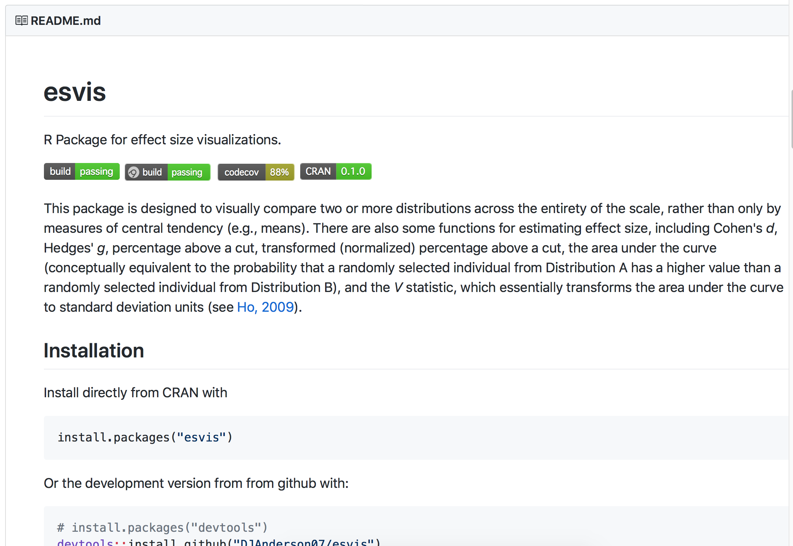
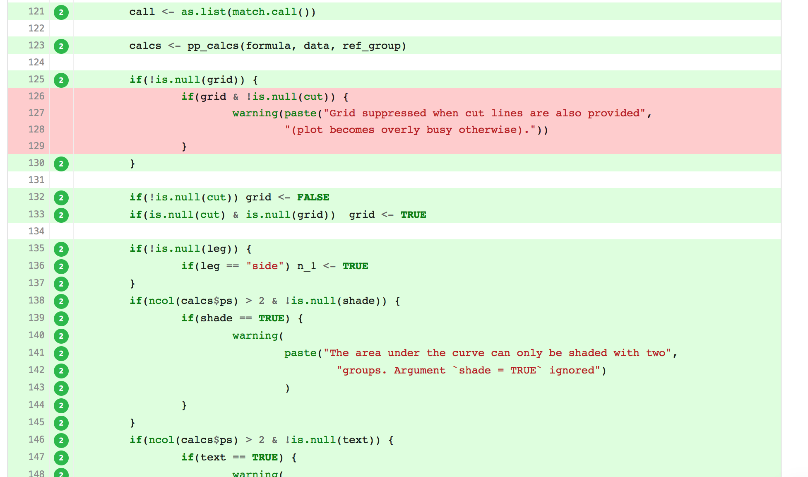

```{r include = FALSE, results = "asis"}
source(here::here("static", "slides", "slide-setup.R"))
xaringanExtra::use_clipboard()
knitr::opts_chunk$set(fig.width = 13, 
                      message = FALSE, 
                      warning = FALSE)

library(tidyverse)
theme_set(theme_minimal(20))
update_geom_defaults("point", list(size = 3))
```

`r setup("w10p2")`

---
# Agenda

* Basics of package development

* An example from my first CRAN package

* Creating a package (we'll actually do it!)

---
# Want to follow along?

If you'd like to follow along, please make sure you have the following packages installed

```{r package_installs, eval = FALSE}
install.packages(c("tidyverse", "devtools", "esvis",
                   "roxygen2", "usethis"))
```

---
# Bundle your functions
Once you've written more than one function, you may want to bundle them. There are two general ways to do this:

--

.pull-left[
.center[.Large[source?]]
] 

.pull-right[
.center[.Large[Write a package]]
]

--

<center></center>

---
# Why avoid `source`ing

* Documentation is generally more sparse

* Directory issues

  + Which leads to reproducibility issues

  + This is also less of an issue if you're using RStudio Projects and {here}

---
# More importantly
.Large[Bundling functions into a package is not that hard!]


---
class: inverse-blue middle
# My journey with {esvis}
## My first CRAN package

---
# Background
### Effect sizes
Standardized mean differences

--

* Assumes  reasonably normally distributed distributions (mean is a good indicator of central tendency)

--

* Differences in means may not reflect differences at all points in scale if variances are different

--

* Substantive interest may also lie with differences at other points in the distribution.

---
# Varying differences
### Quick simulated example

```{r simulated_es_diff, message = FALSE}
library(tidyverse)
common_var <- tibble(low  = rnorm(1000, 10, 1),
                     high = rnorm(1000, 12, 1),
                     var  = "common")
diff_var <- tibble(low  = rnorm(1000, 10, 1),
                   high = rnorm(1000, 12, 2),
                   var  = "diff")
d <- bind_rows(common_var, diff_var)
head(d)
```

---
# Restructure for plotting

```{r gather_dists}
d <- d %>% 
  pivot_longer(
    -var,
    names_to = "group", 
    values_to = "value"
  ) 
d
```

---
# Plot the distributions

```{r plot_dists, fig.height = 4.5, fig.width = 11}
ggplot(d, aes(value, fill = group)) +
  geom_density(alpha = 0.7,
               color = "gray40") +
  facet_wrap(~var) +
  scale_fill_brewer(palette = "Set3")
```

---
# Binned effect sizes

1. Cut the distributions into $n$ bins (based on percentiles)

2. Calculate the mean difference between paired bins

3. Divide each mean difference by the overall pooled standard deviation

$$
d\_{[i]} = \frac{\bar{X}\_{foc\_{[i]}} - \bar{X}\_{ref\_{[i]}}}
        {\sqrt{\frac{(n\_{foc} - 1)Var\_{foc} + (n\_{ref} - 1)Var\_{ref}}
                  {n\_{foc} + n\_{ref} - 2}}}
$$

--
### visualize it!

---
# Back to the simulated example

```{r subset_sim}
common <- filter(d, var == "common")
diff   <- filter(d, var == "diff")
```

---
```{r sim_binned_es}
library(esvis)
binned_es(common, value ~ group)
binned_es(diff, value ~ group)
```

---
# Visualize it
### Common Variance
```{r sim_binned_plot_common, fig.height = 6.5}
binned_plot(common, value ~ group)
```

---
# Visualize it
### Different Variance
```{r sim_binned_plot_diff, fig.height = 6.5}
binned_plot(diff, value ~ group)
```

---
# Wait a minute...

.pull-left[
* The *esvis* package will (among other things) calculate and visually display binned effect sizes.
* But how did we get from an idea, to functions, to a package?
]

.pull-right[]

---
class: inverse-red middle
# Taking a step back

---
# Package Creation
### The (or rather a) recipe
1. Come up with ~~a brilliant~~ an idea 
  + can be boring and mundane but just something you do a lot
--

2. Write a function! .gray[or more likely, a set of functions]
--

3. Create package skelton
--

4. Document your function
--

5. Install/fiddle/install
--

6. Write tests for your functions
--

7. Host your package somewhere public .gray[(GitHub is probably best)] and promote it - leverage the power of open source!

--

Use tools to automate

---
# A really good point

<blockquote class="twitter-tweet" data-conversation="none" data-lang="en"><p lang="en" dir="ltr">1a) check that no one had the same idea 😇</p>&mdash; Maëlle Salmon 🐟 (@ma_salmon) <a href="https://twitter.com/ma_salmon/status/983572108474241025?ref_src=twsrc%5Etfw">April 10, 2018</a></blockquote> <script async src="https://platform.twitter.com/widgets.js" charset="utf-8"></script>

<br/>

[And some further recommendations/good advice](http://www.masalmon.eu/2017/12/11/goodrpackages/)

---
# Some resources 
We surely won't get through everything. In my mind, the best resources are:

.pull-left[
### Advanced R

]

.pull-right[
### R Packages

]


---
# Our package
We're going to write a package today! Let's keep it really simple...

1. Idea (which we've actually used before): Report basic descriptive statistics
for a vector, `x`: `N`, `n-valid`, `n-missing`, `mean`, and `sd`. 

---
# Our function
* Let's have it return a data frame

* What will be the formal arguments?

* What will the body look like?


--
### Want to give it a go?

---
# The approach I took...

```{r fun}
describe <- function(data, column_name) {
  x <- data[[column_name]]
  
  nval  <- length(na.omit(x))
  nmiss <- sum(is.na(x))
  mn    <- mean(x, na.rm = TRUE)
  stdev <- sd(x, na.rm = TRUE)
  
  out <- tibble::tibble(N         = nval + nmiss,
                        n_valid   = nval, 
                        n_missing = nmiss, 
                        mean      = mn, 
                        sd        = stdev)
  out
}
```

---
# The approach I took...

```{r fun_h1}
describe <- function(data, column_name) {
  x <- data[[column_name]] # Extract just the vector to summarize #<< 
  
  nval  <- length(na.omit(x))
  nmiss <- sum(is.na(x))
  mn    <- mean(x, na.rm = TRUE)
  stdev <- sd(x, na.rm = TRUE)
  
  out <- tibble::tibble(N         = nval + nmiss,
                        n_valid   = nval, 
                        n_missing = nmiss, 
                        mean      = mn, 
                        sd        = stdev)
  out
}
```

---
# The approach I took...

```{r fun_h2}
describe <- function(data, column_name) {
  x <- data[[column_name]] 
  
  nval  <- length(na.omit(x)) # Count non-missing #<< 
  nmiss <- sum(is.na(x)) # Count missing #<< 
  mn    <- mean(x, na.rm = TRUE) # Compute mean #<< 
  stdev <- sd(x, na.rm = TRUE) # Computer SD #<< 
  
  out <- tibble::tibble(N         = nval + nmiss,
                        n_valid   = nval, 
                        n_missing = nmiss, 
                        mean      = mn, 
                        sd        = stdev)
  out
}
```

---
# The approach I took...

```{r fun_h3}
describe <- function(data, column_name) {
  x <- data[[column_name]] 
  
  nval  <- length(na.omit(x)) 
  nmiss <- sum(is.na(x)) 
  mn    <- mean(x, na.rm = TRUE) 
  stdev <- sd(x, na.rm = TRUE) 
  
  # Compile into a df
  out <- tibble::tibble(N         = nval + nmiss, #<< 
                        n_valid   = nval, #<<
                        n_missing = nmiss, #<<
                        mean      = mn, #<<
                        sd        = stdev) #<<
  out
}
```

---
# The approach I took...

```{r fun_h4}
describe <- function(data, column_name) {
  x <- data[[column_name]] 
  
  nval     <- length(na.omit(x)) 
  nmiss <- sum(is.na(x)) 
  mn    <- mean(x, na.rm = TRUE) 
  stdev <- sd(x, na.rm = TRUE) 
  
  out <- tibble::tibble(N         = nval + nmiss, 
                        n_valid   = nval, 
                        n_missing = nmiss,
                        mean      = mn, 
                        sd        = stdev)
  out # Return the table #<< 
}
```

---
# Informal testing

```{r informal_test}
set.seed(8675309)
df1 <- tibble(x = rnorm(100))
df2 <- tibble(var_miss = c(rnorm(1000, 10, 4), rep(NA, 27)))
describe(df1, "x")
describe(df2, "var_miss")
```

---
# Demo
Package skeleton: 
* `usethis::create_package()`
* `usethis::use_r()`
* Use `roxygen2` special comments for documentation
* Run `devtools::document()`
* Install and restart, play around

---
# roxygen2 comments

**Typical arguments**
* `@param`: Describe the formal arguments. State argument name and the describe it.

> `#' @param x Vector to describe`

* `@return`: What does the function return

> `#' @return A tibble with descriptive data`

* `@example` or more commonly `@examples`: Provide examples of the use of your function.

---
* `@export`: Export your function

If you don't include `@export`, your function will be *internal*, meaning others can't access it easily. 

---
# Other docs

* **`NAMESPACE`**: Created by **{roxygen2}**. Don't edit it. If you need to, trash it and it will be reproduced. 

* **`DESCRIPTION`**: Describes your package (more on next slide)

* **`man/`**: The documentation files. Created by **{roxygen2}**. Don't edit.

---
# `DESCRIPTION`
Metadata about the package. Default fields for our package are 

```
Package: practice
Version: 0.0.0.9000
Title: What the Package Does (One Line, Title Case)
Description: What the package does (one paragraph).
Authors@R: person("First", "Last", email = "first.last@example.com", role = c("aut", "cre"))
License: What license is it under?
Encoding: UTF-8
LazyData: true
ByteCompile: true
RoxygenNote: 6.0.1
```
--

This is where the information for `citation(package = "practice")` will come from.

--

Some advice - edit within RStudio, or a good text editor like [sublimetext](http://www.sublimetext.com) or [VSCode](https://code.visualstudio.com/). "Fancy" quotes and things can screw this up.

---
# Description File Fields
> The ‘Package’, ‘Version’, ‘License’, ‘Description’, ‘Title’, ‘Author’, and ‘Maintainer’ fields are mandatory, all other fields are optional.
.right[[- Writing R Extensions](https://cran.r-project.org/doc/manuals/r-release/R-exts.html#The-DESCRIPTION-file)]

Some optional fields include
* Imports and Suggests (we'll do this in a minute).
* URL
* BugReports
* License (we'll have {usethis} create this for us).
* LazyData

---
# `DESCRIPTION` for {esvis} 

```
Package: esvis
Type: Package
Title: Visualization and Estimation of Effect Sizes
Version: 0.3.1
Authors@R: person("Daniel", "Anderson", email = "daniela@uoregon.edu", 
	   role = c("aut", "cre"))
Description: A variety of methods are provided to estimate and visualize
    distributional differences in terms of effect sizes. Particular emphasis
    is upon evaluating differences between two or more distributions across
    the entire scale, rather than at a single point (e.g., differences in
    means). For example, Probability-Probability (PP) plots display the
    difference between two or more distributions, matched by their empirical
    CDFs (see Ho and Reardon, 2012; <doi:10.3102/1076998611411918>), allowing
    for examinations of where on the scale distributional differences are
    largest or smallest. The area under the PP curve (AUC) is an effect-size
    metric, corresponding to the probability that a randomly selected
    observation from the x-axis distribution will have a higher value
    than a randomly selected observation from the y-axis distribution. 
    Binned effect size plots are also available, in which the distributions
    are split into bins (set by the user) and separate effect sizes (Cohen's
    d) are produced for each bin - again providing a means to evaluate the
    consistency (or lack thereof) of the difference between two or more 
    distributions at different points on the scale. Evaluation of empirical 
    CDFs is also provided, with  built-in arguments for providing annotations 
    to help evaluate distributional differences at specific points (e.g., 
    semi-transparent shading). All function take a consistent argument 
    structure. Calculation of specific effect sizes is also possible. The
    following effect sizes are estimable: (a) Cohen's d, (b) Hedges' g, 
    (c) percentage above a cut, (d) transformed (normalized) percentage above 
    a cut, (e)  area under the PP curve, and (f) the V statistic (see Ho, 
    2009; <doi:10.3102/1076998609332755>), which essentially transforms the 
    area under the curve to standard deviation units. By default, effect sizes 
    are calculated for all possible pairwise comparisons, but a reference 
    group (distribution) can be specified.
```

---
# `DESCRIPTION` for {esvis} (continued)

```
Depends:
    R (>= 3.1)
Imports:
    sfsmisc,
    ggplot2,
    magrittr,
    dplyr,
    rlang,
    tidyr (>= 1.0.0),
    purrr,
    Hmisc,
    tibble
URL: https://github.com/datalorax/esvis
BugReports: https://github.com/datalorax/esvis/issues
License: MIT + file LICENSE
LazyData: true
RoxygenNote: 7.0.2
Suggests:
	testthat, 
	viridisLite
```

---
# Demo
* Change the author name. 
  + Add a contributor just for fun.
* Add a license. We'll go for MIT license using `usethis::use_mit_license("First and Last Name")`
* Install and reload.

---
# Declare dependencies
* The function **depends on** the `tibble` function within the [{tibble}](https://www.tidyverse.org/articles/2018/01/tibble-1-4-2/) package. 

* We have to declare this dependency

---
# My preferred approach
* Declare package dependencies: `usethis::use_package()`

* Create a package documentation page: `usethis::use_package_doc()`

  + Declare all dependencies for your package there

  + Only import the functions you need - not the entire package

      - Use `#' importFrom pkg fun_name`

* Generally won't have to worry about namespacing. The likelihood of conflicts is also reduced, so long as you don't import the full package.

---
class: inverse-blue middle

# Demo

---
# Write tests!

* What does it mean to write tests?

  + ensure your package does what you expect it to

--

* Why write tests?
  + If you write a new function, and it breaks an old one, that's good to know! 
  + Reduces bugs, makes your package code more robust
  
---
# How
* `usethis::use_testthat` sets up the infrastructure

* Make assertions, e.g.: `testthat::expect_equal()`, `testthat::expect_warning()`, `testthat::expect_error()`

---
# Testing 

We'll skip over testing for today, because we just don't have time to cover everything. A few good resources:

.pull-left[

]

.pull-right[
[Richie Cotton's book](https://www.amazon.com/Testing-Code-Chapman-Hall-CRC/dp/1498763650)

[r-pkgs Chapter](http://r-pkgs.had.co.nz/tests.html)

[Karl Broman Blog Post](http://kbroman.org/pkg_primer/pages/tests.html)
]

---
# Check your R package
* Use `devtools::check()` to run the same checks CRAN will run on your R package.

  + Use `devtools::check_rhub()` to test your package on https://builder.r-hub.io/ (several platforms and R versions)

  + Use `devtools::build_win()` to run the checks on CRAN computers.


--
I would not run the latter two until you're getting close to being ready to submit to CRAN.

---
# Patience

The first time, you'll likely get errors. It will probably be frustrating, but ultimately worth the effort.


---
class: inverse-blue center middle
# Let's check now!


---
class: center
# 🎉 Hooray! 🎉
### You have a package!


---
# A few other best practices
* Create a `README` with `usethis::use_readme_rmd`.

--

* Try to get your [code coverage](https://en.wikipedia.org/wiki/Code_coverage) up above 80%.

--

* Automate wherever possible ([{devtools}](https://github.com/r-lib/devtools) and [{usethis}](https://github.com/r-lib/usethis) help a lot with this)

--

* Use the [{goodpractice}](https://github.com/MangoTheCat/goodpractice) package to help you package code be more robust, specifically with `goodpractice::gp()`. It will give you lots of good ideas

---
# A few other best practices

* Host on GitHub, and capitalize on integration with other systems (all free, but require registering for an account)

  + [Github Actions](https://github.com/features/actions)

  + [codecov](https://codecov.io)
  
---
class: inverse-blue center middle

# Any time left?


---
# Create a `README`
* Use standard R Markdown. Setup the infrastructure with `usethis::use_readme_rmd`. 
* Write it just like a normal R Markdown doc and it should all flow into the `README`.



---
# Use GitHub Actions
* Run `usethis::use_github_actions()` to get started.

  + Go to the Actions tab on your repo
  
  + Copy and paste the code to the badge into your `README`.


--

* Now all your code will be automatically tested each time you push!


---
# codecov
You can test your code coverage each time you push a new commit by using [codecov](https://codecov.io). Initialize with `usethis::use_coverage()`. Overall setup process is pretty similar to Travis CI/Appveyor.

Easily see what is/is not covered by tests!



---
class: inverse-green middle

# That's all
### Thanks so much!
