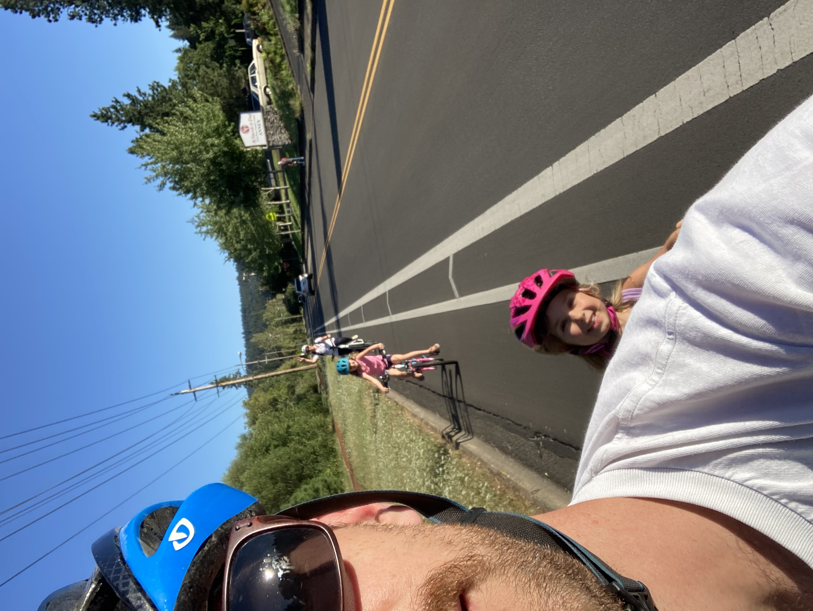

```{r include = FALSE, results = "asis"}
source(here::here("static", "slides", "slide-setup.R"))
```

`r setup("w1p1")`

---
# Agenda 

.pull-left[

* Getting on the same page
* Syllabus
* A little bit of git/GitHub
]

.pull-right[

]

---

# whoami

.pull-left[
* Research Assistant Professor: Behavioral Research and Teaching
* Dad (two daughters: 8 and 6)
* Pronouns: he/him/his
* Primary areas of interest: 💗💗R💗💗, computational research, achievement gaps, systemic inequities, and variance between educational institutions
]

.pull-right[


</div>
]

---
class: center middle inverse-blue

# whoisyou?

.left[
* Introduce yourself
* Why are you here?
* What pronouns would you like us to use for you for this class?
* What was one thing you did not related to academic work over winter break?
]

---

# A few class policies

--
* Be kind


--
* Be understanding and have patience, with others and yourself


--
* Help others whenever possible


--
Truly the most important part of this class. Important not just in terms of decency, but also in your learning, and most importantly, for equity. 

---
# A bit more specific

Normally I would have information here about welcoming kids into class.

Because we're virtual, that part is both easier and harder.


--

If you need to not attend class, or a portion of class, for any reason, that is fine.

--

Ideally you would let me know ahead of time. But we're in the middle of a pandemic and life is cray. Please .b[try] to contact me beforehand. If this isn't possible, please check in with me after.

---

# Last intro thing

* I'm here for you

* We won't have specific office hours, but know I'm always willing to meet

* This course, like all in the sequence, can be difficult. Don't suffer in silence. Don't do this alone.

---
class: inverse-green middle
background-size:cover

# Syllabus

---

# Course Website(s)

.pull-left[
## [website](https://dataviz-2021.netlify.app)
]

.pull-right[
.right[
## [repo](https://github.com/uo-datasci-specialization/c2-dataviz-2021)
  ]
]


```{r echo = FALSE}
knitr::include_url("https://dataviz-2021.netlify.app")
```

---
# Materials
* Nearly everything will be distributed through the repo and through the website.

* Please clone the repo now, if you haven't already. Pull each week for the most recent changes.

* We'll use Canvas for grading, and that is essentially it.

---
# R Markdown notes
* These slides were produced with [**{xaringan}**](https://github.com/yihui/xaringan), an R Markdown variant. I encourage you to try it out and use it for your final project presentation.

* The website was also produced with R Markdown (sort of)
  + It's a [**{blogdown}**](https://github.com/rstudio/blogdown) website with some custom CSS and Hugo shortcodes
  
* This course is not just about data viz, but also mediums for communication. This includes websites and [data dashboards](https://jenthompson.me/examples/insight_progress.html) among other possibilities.


---
class: inverse-red middle

# My assumptions about you

---
# I assume you

* Understand the R package ecosystem (how to find, install, load, and learn about them)


--
* Can read "flat" (i.e., rectangular) datasets into R 

  + I don't care what you use, but you should be using RStudio Projects & the [{here}](https://github.com/r-lib/here) package

    - See [Jenny Bryan's blog post](https://www.tidyverse.org/articles/2017/12/workflow-vs-script/) for why.


---
* Can perform basic data wrangling and transformations in R, using the
tidyverse  

  + Leverage appropriate functions for introductory data science tasks (pipeline)
  + "clean up" the dataset using scripts and reproducible workflows

--

* Use version control with R via git and GitHub  


--
* Use R Markdown to create reproducible dynamic reports


---
# Learning objectives

* Transform data in a variety of ways to create effective data visualizations

--

* Understand and fluently apply different types of data joins

--
* Understand best practices in data visualization

--

* Customize ggplot2 graphics by reordering factors, creating themes, and applying ggthemes


--

* Create an online data visualization portfolio using distill and/or flexdashboards to demonstrate key learning 


---

# Examples
Below are some links to final projects from students who took this class last year.

.pull-left[
### Dashboards
* [Alexis Adams-Clark](https://alexisadamsclark.github.io/dashboard_finalproj/)
* [Brendan Cullen](https://brendanhcullen.github.io/data-viz-dashboard/)
* [Ouafaa Hmaddi](https://ohmaddi.github.io/Portfolio-Kiva/)
]

.pull-right[
### Blog post
* [Teresa Chen](https://teresashchen.github.io/blog/)
* [Ashley Miller](https://ashlynnmiller.github.io/MsRememberingBlog/)
* [Karlena Ochoa](https://karlenaochoa.github.io/610_website/)
]


---
# Weekly learning objectives

Provide you a frame for what you should be working to learn for that specific week.

--

### This week's objectives
* Understand the requirements of the course
* Understand the requirements of the final project
* Be ready to go with *git* and GitHub


---

# Required Textbooks (free)

.pull-left[
## [Healy](http://socviz.co)

<div>

</div>

]

.pull-right[
.right[
## [Wilke](https://serialmentor.com/dataviz/)
]

<div>
 </div>


]


---

# Other books (also free)

.pull-left[

## [Bryan](http://happygitwithr.com)
]

.pull-right[
.right[
<div>
 
</div>
  ]
]

.right[
### [Wickham & Grolemund](https://r4ds.had.co.nz)
]
---
class: inverse-green middle

## Another resource
See the current draft [here](https://www.sds.pub). Please read Chapter 8 before next class.

```{r echo = FALSE}
knitr::include_url("https://www.sds.pub")
```


---
class: inverse-orange middle
# Extra credit opportunity
**10 points**: Deep dive into a topic not covered by the course


---
# Some options

* Geographic data (we'll have an intro, but there's a ton here and we won't really do it justice)
* Network data
* Text data
* DAGs
* Flow data (e.g., alluvial diagrams)
* Relational data (SQL & friends)
* Interactive plots
* Animated plots

---
class: inverse-blue  middle
# Some examples

---
background-image:url(https://timogrossenbacher.ch/wp-content/uploads/2016/12/tm-final-map-1.png)
background-size:contain

<br/>


[Timo Grossenbacher](https://timogrossenbacher.ch/2016/12/beautiful-thematic-maps-with-ggplot2-only/)

---
class: inverse
background-image:url(https://user-images.githubusercontent.com/25231784/41408567-08313b66-6fcb-11e8-8c55-75baa36364cd.png)
background-size:contain

<br/>
<br/>

[Paul Campbell](https://gist.github.com/PaulC91/e767ca4f0c4335e6e0d2f71eb7cc98cc)

---
class: bottom
background-image:url(https://ggdag.netlify.com/articles/intro-to-dags_files/figure-html/unnamed-chunk-11-1.png)
background-size:contain

<br/>
<br/>

[ggdag](https://ggdag.netlify.com/articles/intro-to-dags.html) via Malcolm Barrett


---
class: bottom
background-image:url(https://static01.nyt.com/images/2018/05/02/learning/economic-mobilityLN/economic-mobilityLN-superJumbo.png?quality=90&auto=webp)
background-size:contain

<br/>
<br/>

[Patrick Honner](https://www.nytimes.com/2018/05/03/learning/lesson-plans/moving-on-up-teaching-with-the-data-of-economic-mobility.html) via NYT

---
class: bottom
background-image:url(https://cloud.githubusercontent.com/assets/7896861/17839509/d66b3c2a-67b7-11e6-9ee4-5f8ad54746d7.gif)
background-size:contain

<br/>
<br/>

[James Curley](https://github.com/jalapic/nba)

---
# Labs

See the [assignments](https://dataviz-2021.netlify.app/assignments/) page of the website.

10 points each (30 points total; 15%)

1. Distributions & GitHub collabo 

1. Visual perception  & plot reproducing

1. Color


---
# Homework
20 points each (40 points; 20%)

* Basically the same as the labs, but scored correct/incorrect, and no in-class time devoted to them.

* Okay to work on collaboratively - I actively encourage you to do so as long as you're using a shared repo


--

* **Homework 1**: Creating new visuals while utilizing different types of joins 

* **Homework 2**: Visualizing uncertainty, tables, and plot refinement


---
# Quick note on reproducibility

A [great blog post](https://simplystatistics.org/2019/08/28/you-can-replicate-almost-any-plot-with-ggplot2/) by [Rafael Irizarry](https://twitter.com/rafalab) shows how almost any plot you see in popular media can be reproduced in R with ggplot.

--

### For example


---
# WSJ Version

 

---
# ggplot reproduction


---
# Data viz "in the wild" presentations
Everyone will present for ~5 minutes - order randomly assigned (coming up next)

* Find two data viz examples intended for two different audiences

* Discuss the following
  - What's trying to be communicated
  - How effective do you judge it? Why?
  - At least 1 area of strength
  - At least 1 area for (potential) improvement


---

# Presentation order

.footnote[I will email this out as well. ]

```{r pres-wildorder, echo = FALSE, results = "asis", message = FALSE}
library(tidyverse)
library(lubridate)
peeps <- c("Janette", "Anisha", "Ann-Marie", "Hyeonjin", "Kay", "Sarah Dim", "Sarah Don", 
           "David", "Raleigh", "Anwesha", "Wanjia", "Maggie", "Murat", 
           "Rachael", "Chris", "Kavya", "Tess", "Zach", "Meg", 
           "Vinita", "Makayla", "Shijing", "Joe")

dates <- mdy(
  c("1/11/21", "1/11/21", "1/13/21", "1/13/21",
    "1/20/21", "1/20/21", "1/25/21", "1/25/21",
    "1/27/21", "1/27/21", "2/1/21", "2/1/21",
    "2/3/21", "2/3/21", "2/10/21", "2/10/21",
    "2/15/21", "2/15/21", "2/17/21", "2/22/21", 
    "2/24/21", "3/1/21", "3/3/21")
  )

#length(peeps)/ length(dates)

set.seed(23)
assigned <- tibble(Date = sample(dates), Presenter = sample(peeps)) %>% 
  arrange(Date)
```

.pull-left[
```{r echo = FALSE, message=FALSE}
library(kableExtra)

kbl(assigned[1:11, ]) 
```
]

.pull-right[
```{r echo = FALSE}
kbl(assigned[12:nrow(assigned), ])
```
]

---
class: inverse-red middle
# Final Project 
120 points total (60%)

---
# Six parts
* Proposal (10 points): Due 1/27/21

* Draft (15 points): Due 2/24/21

* Peer review (15 points): Assigned, 2/24/21; Due 3/3/21

* Presentation (20 points): 3/8/21 and 3/10/21 (Week 10)

* Product (60 points): Due 11:59:59 PM, 3/17/21


---
# Product

### Four components: 

* A web-deployed portfolio showcasing your [#dataviz](https://twitter.com/search?q=%23DataViz&src=tyah)
  skills.
  + [distill](https://rstudio.github.io/distill/) (what I'll lecture on), 
    [R Markdown](https://bookdown.org/yihui/rmarkdown/rmarkdown-site.html), or
    [blogdown](https://bookdown.org/yihui/blogdown/) website
  + Technical document with [pagedown](https://github.com/rstudio/pagedown) or
    [bookdown](https://bookdown.org/yihui/bookdown/)
  + Scientific poster with [pagedown](https://github.com/rstudio/pagedown)
  + [flexdashboard](https://rmarkdown.rstudio.com/flexdashboard/)

---

* At least three finalized data displays, with each accompanied by a strong 
  narrative/story, as well as the history of how the visualization changed over 
  time.
  
* Housed on GitHub
  + Fully reproducible

* Deployed through [GitHub pages](https://pages.github.com) (or netlify or similar)


---
# Proposal

### Four components:

* Description of the data source (**must** be publicly available)

* Preliminary ideas of different viz

* Identification of the intended audience for each viz 

* The intended message to be communicated for each viz 

---
# Draft

* Expected to still be a work in progress
  + Data visualizations should be largely complete

* Deployment not expected

* Provided to your peers so they can learn from you as much as you can learn from their feedback

---
# Peer Review
* We are all professionals here. It is imperative we act like it. 

* Understand the purpose of the exercise.  

* Zero tolerance policy for inappropriate comments

* Should be vigorously encouraging 

--

### Utilizing GitHub
You'll be assigned three proposals to review (5 points each)

* Fork their repo, embed comments & suggest changes to their code, submit a PR

---
# Presentation 
Order randomly assigned. Basically a chance to share what you created!

* Discuss what is trying to be communicated

* Share the final products

* Discuss the progression along the way and why specific changes were made


---
class: inverse-blue middle
# Grading

---
# Points
### 200 points total
* 3 labs at 10 points each (30 points; 15%) 
* 2 homework assignments at 20 points each (40 points; 20%) 
* five-minute data visualization "in the wild" presentation (10 points; 5%) 
* Final Project (120 points; 60%)
  + Proposal (10 points; 5%)
  + Draft (15 points; 7.5%)
  + Peer review (25 points; 12.5%)
  + Presentation (10 points; 10%)
  + Product (60 points; 30%)


---

# Grading


|  **Lower percent** |**Lower point range**  | **Grade** | **Upper point range**  | **Upper percent**|
|  :------: | :------   | :-:| :-------: | ----:|
|  0.97     | (194 pts) | A+ |           |      |
|  0.93     | (186 pts) | A  | (194 pts) | 0.97 |
|  0.90     | (180 pts) | A- | (186 pts) | 0.93 |
|  0.87     | (174 pts) | B+ | (180 pts) | 0.90 |
|  0.83     | (166 pts) | B  | (174 pts) | 0.87 |
|  0.80     | (160 pts) | B- | (166 pts) | 0.83 |
|  0.77     | (154 pts) | C+ | (160 pts) | 0.80 |
|  0.73     | (146 pts) | C  | (154 pts) | 0.77 |
|  0.70     | (140 pts) | C- | (146 pts) | 0.73 |
|           |           | F  | (140 pts) | 0.70 |

---
class: inverse
background-image:url(https://d194ip2226q57d.cloudfront.net/original_images/10_Tips_for_Workplace_Communication)
background-size:contain


---
class: inverse-green center bottom
background-image:url(https://cdn-images-1.medium.com/max/1600/1*aFHTAkhTkyWD93-UGRttPw.png)
background-size:contain

## Full lecture on Wednesday

**My goal:** To make you the most prepared cohort with GitHub to date!

---
# Demo
* The [gitkraken](https://www.gitkraken.com) GUI
* Creating a GitHub repo
* Sharing access (or creating an organization)
* Cloning the repo
* stage, commit, push
* pull
* branching
* forking and issues


---
class:inverse-orange middle center

# Next time

### Collaborating with GitHub
