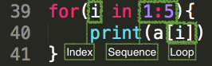

```{r include = FALSE, results = "asis"}
source(here::here("static", "slides", "slide-setup.R"))
```

`r setup("w2p1")`


```{r setup, include = FALSE}
library(tidyverse)
library(tictoc)
theme_set(theme_minimal(25))
update_geom_defaults('density', list(size = 1.2))
```

---
# Agenda
* For loops 
* Apply family of loops
    + `lapply()`
    + `sapply()`
    + `vapply()`

--
Note - we won't get to `apply` or `tapply`, but the former in particular is probably worth investigating.

---
# Learning objectives
* Understand the basics of what it means to loop through a vector

* Begin to recognize use cases

* Be able to apply basic `for` loops and write their equivalents with `lapply`.

---
# Basic overview: `for` loops



--

```{r letters}
a <- letters[1:26]
a
```

--

.pull-left[
```{r first-for-loop}
for(i in 1:5){
	print(a[i])
}
```
]

--
.pull-right[
Note these are five different character scalars (atomic vectors of length one).
It is NOT a single vector.
]

---
# Another basic example
### Simulate tossing a coin, record results

--
* For a single toss

```{r toss}
sample(c("Heads", "Tails"), 1)
```

--
* For multiple tosses, first allocate a vector with `length` equal to the number of iterations


```{r allocate-vector}
result <- rep(NA, 10)
result
```

---
* Next, run the trial $n$ times, storing the result in your pre-allocated vector.

```{r for-flip1}
for(i in seq_along(result)) {
	result[i] <- sample(c("Heads", "Tails"), 1)
}
result
```

---
# Growing vectors

* **Always** pre-allocate a vector for storage before running a `for` loop. 


--
* Contrary to some opinions you may see out there, `for` loops are not actually slower than `lapply`, etc., provided the `for` loop is written well


--
* This primarily means .b[not] growing a vector

---
# Example
100,000 coin flips by growing a vector

```{r time-for-loop, cache = TRUE}
library(tictoc)

set.seed(1)
tic()
not_allocated <- sample(c("Heads", "Tails"), 1)
for(i in seq_len(1e5 - 1)) {
	not_allocated <- c(
	  not_allocated, 
	  sample(c("Heads", "Tails"), 1)
	 )
  
}
toc()
```

---
same *exact* thing with pre-allocated vector

```{r}
set.seed(1)
tic()
allocated <- rep(NA, 1e5)
for(i in seq_len(1e5)) {
	allocated[i] <- sample(c("Heads", "Tails"), 1)
}
toc()
```

---
# Result
* The result is the same, regardless of the approach (notice I forced the random number generator to start at the same place in both samples)

```{r identical}
identical(not_allocated, allocated)
```

* Speed is obviously not identical


---
# You try

Base R comes with `letters` and `LETTERS`
* Make an alphabet of upper/lower case. For example, create "Aa" with `paste0(LETTERS[1], letters[1])`

* Write a `for` loop for all letters

`r countdown::countdown(3)`

---
# Answer

```{r alphabet-for-loop}
alphabet <- rep(NA, length(letters))

for(i in seq_along(alphabet)) {
	alphabet[i] <- paste0(LETTERS[i], letters[i])
}
alphabet
```

---
# Quick style note
* Why am I always using `seq_along`?

--
* When writing functions, it's safer to use `seq_*` because you can't always be guaranteed of the input

```{r seq}
x <- data.frame()
1:length(x)
seq_along(x)
```

---
# Running the loop

```{r loop-seq, error = TRUE}
for(i in 1:length(x)) {
	print(letters[i])
}

for(i in seq_along(x)) {
	print(letters[i])
}
```

* The first  may return unhelpful error messages or unexpected output, while the latter simply won't run, which is generally easier to diagnose.


--
* Even better, if you're using a loop in a function, you should probably have a condition that checks the input before running it

---
# Another example
* Say we wanted to simulate 100 cases from random normal data, where we varied the standard deviation in increments of 0.2, ranging from 1 to 5


--
* First, specify a vector standard deviations

```{r sd-increments}
increments <- seq(1, 5, by = 0.2)
```

--
* Next, allocate a vector. There are many ways I could store this result (data frame, matrix, list). I'll do it in a list.

```{r allocate-list}
simulated <- vector("list", length(increments))
str(simulated)
```

---
# Write `for` loop

```{r simulated-loop}
for(i in seq_along(simulated)) {
	simulated[[i]] <- rnorm(100, 0, increments[i]) 
	# note use of `[[` above
}
str(simulated)
```

---
# List/data frame
* Remember, if all the vectors of our list are the same length, it can be transformed into a data frame.

* First, let's provide meaningful names

```{r names-simultated-loop}
names(simulated) <- paste0("sd_", increments)
sim_d <- data.frame(simulated)
head(sim_d)
```

---
# tidyverse
* One of the *best* things about the tidyverse is that it often does the looping for you

.pull-left[
```{r plot-echo, eval = FALSE}
library(tidyverse)
pd <- sim_d %>%
	pivot_longer(
	  everything(),
	  names_to = "sd", 
	  values_to = "sim",
	  names_prefix = "sd_",
	  names_ptypes = list(
	    sd = factor()
	  )
	) 

ggplot(pd, aes(sim)) +
 geom_density(
   aes(color = sd)
 ) +
 guides(color = "none") 
```
]


.pull-right[
```{r plot-eval, echo = FALSE}
library(tidyverse)
pd <- sim_d %>%
	pivot_longer(everything(),
	             names_to = "sd", 
	             values_to = "sim",
	             names_prefix = "sd_",
	             names_ptypes = list(sd = factor())) 

ggplot(pd, aes(sim)) +
 geom_density(aes(color = sd)) +
 guides(color = "none") 
```
]

---
class: inverse-red middle

> Of course, someone has to write loops. It doesn't have to be you.
> --- Jenny Bryan

---
# Base R Method

* Calculate all the densities

```{r densities}
densities <- vector("list", length(sim_d))
for(i in seq_along(densities)) {
	densities[[i]] <- density(sim_d[ ,i])
}
str(densities)
```

---
* Next, plot the first density

```{r first-density, fig.height = 6}
plot(densities[[1]])
```

---
* Finally, loop through all the other densities

```{r all-densities, fig.height = 5}
plot(densities[[1]], xlim = c(-20, 20))

for(i in seq(2, length(densities))) {
	lines(x = densities[[i]]$x, 
	      y = densities[[i]]$y)	
}
```

---
# Skipping iterations
* On the prior slide, I set the index to skip over the first by using `seq(2, length(densities))`

--
* Alternatively, the loop could have been written like this

```{r loop-skip, fig.height = 3}
plot(densities[[1]], xlim = c(-20, 20))

for(i in seq_along(densities)) {
	if(i == 1) next
	lines(x = densities[[i]]$x, 
	      y = densities[[i]]$y)	
}
```

---
# Breaking loops

* Similarly, if a condition is met, you may want to break out of the loop

```{r loop-break}
set.seed(1)

rand_unif <- vector("double", 10)

for(i in seq_along(rand_unif)) {
	rand_unif[i] <- runif(1, 0, 10)
	if(any(rand_unif > 5)) {
		break
	}
}

rand_unif
```

---
class: inverse-blue center middle
# *apply

---
# `lapply`
* One of numerous *functionals* in R

* A functional "takes a function as an input and returns a vector as output" ([adv-r, Chpt 9](https://adv-r.hadley.nz/functionals.html))

--

* `lapply` will **always** return a list

---
## Revisiting our simulation with $n = 10$

Our `for` loop version

```{r for-loop-sim}
increments <- seq(1, 5, by = 0.2)

simulated <- vector("list", length(increments))

for(i in seq_along(simulated)) {
	simulated[[i]] <- rnorm(10, 0, increments[i]) 
	# note use of `[[`
}

simulated
```

---
# The `lapply` version

```{r lapply-sim}
sim_l <- lapply(seq(1, 5, by = 0.2), function(sd) {
 rnorm(10, 0, sd) 
})
sim_l
```


---
# Some more examples
### Loop through a data frame
* Remember - a data frame is a list. We can loop through it easily

--
```{r lapply-df}
library(palmerpenguins)
lapply(penguins, is.double)
```

---
```{r lapply-means}
lapply(mtcars, mean)
```

---
# Add a condition
```{r lapply-conditional}
lapply(penguins, function(x) {
	if(is.numeric(x)) {
		mean(x, na.rm = TRUE)
	}
})
```

---
# Add a second condition

```{r }
lapply(penguins, function(x) {
	if(is.numeric(x)) {
		return(mean(x, na.rm = TRUE))
	}
	else if(is.character(x) | 
		        is.factor(x)) {
    return(table(x))
  }
})
```

---
# Passing arguments

```{r airqual}
head(airquality)

lapply(airquality, mean, na.rm = TRUE)
```

---
# Simulation again

```{r sim-pass-arg}
lapply(seq(1, 5, 0.2), rnorm, n = 10, mean = 0)
```


---
# Mimic `dplyr::group_by`

```{r split}
by_cyl <- split(mtcars, mtcars$cyl)
str(by_cyl)
```

---
```{r mean_mpg_by_cyl}
lapply(by_cyl, function(x) mean(x$mpg))
```


---
# Your turn
Try splitting the penguins dataset by species and calculating the average `bill_length_mm`

`r countdown::countdown(4)`

---
# Produce separate plots

```{r plots_by_cyl-echo, eval = FALSE}
lapply(by_cyl, function(x) {
	ggplot(x, aes(disp, mpg)) +
		geom_point() +
		geom_smooth()
})
```


---
```{r plots_by_cyl-eval, echo = FALSE, message = FALSE, warning = FALSE, fig.height = 2}
lapply(by_cyl, function(x) {
	ggplot(x, aes(disp, mpg)) +
		geom_point() +
		geom_smooth()
})
penguins
```

---
# Your turn
Produce separate plots of the relation between `bill_length_mm` and `body_mass_g`

`r countdown::countdown(4)`

---
# Saving
* You can extend this example further by saving the plot outputs to an object, then looping through that object to save the plots to disk.


--
* Using functionals, this would require parallel iterations, which we'll cover later (need to loop through plots and a file name)


--
* Could extend it fairly easily with a `for` loop

---
# Saving w/`for` loop

### Save plots to an object (list)
```{r save-plots}
plots <- lapply(by_cyl, function(x) {
	ggplot(x, aes(disp, mpg)) +
		geom_point() +
		geom_smooth()
})
```

--
### Specify file names/directory
```{r filenames}
#dir.create(here::here("plots")) 
filenames <- here::here("plots", 
                        paste0("cyl", names(by_cyl), ".png"))
filenames
```

---
# Saving

```{r save-plots-for, eval = FALSE}
for(i in seq_along(plots)) {
	ggsave(filenames[i], # single bracket
	       plots[[i]], # double bracket
	       device = "png",
	       width = 6.5, 
	       height = 8)
}
```

---
class: inverse-orange middle

# You try!

`r countdown::countdown(4)`

---
# Variants of `lapply`

* `sapply`

	+ Will try to .blue[**s**]implify the output, if possible. Otherwise it will return a list.

	+ Fine for interactive work, but I strongly recommend against it if writing a function (difficult to predict the output)


--
* `vapply`

	+ Strict - you specify the output

	+ Use if writing functions (or just always stick with `lapply`), or consider jumping to `{purrr}` (next week)

---
# Examples
### Our simulation

```{r sapply-sim}
sim_s <- sapply(seq(1, 5, by = 0.2), function(x) {
  rnorm(10, 0, x)
})
class(sim_s)
dim(sim_s)

sim_s
```

---
```{r sapply-means}
sapply(penguins, is.double)
```

--
* Now that it's a vector we can easily use it for subsetting

---
```{r iris-subset}
head(penguins)

head( penguins[ ,sapply(penguins, is.double)] )
```


---
# Challenge
Can you make return the opposite? In other words - all those that are *not* double?

`r countdown::countdown(2)`

---
```{r not-double}
head( penguins[ ,!sapply(penguins, is.double)] )
```

---
# `vapply`
* As you can probably see, simplifying can be *really* helpful for interactive work.


--
.center[.blue[.realbig[BUT]]]


--
* Not ideal for programmatic work - need to be able to reliably predict the output


--
* `vapply` solves this issue.

---

```{r vapply1, error = TRUE}
vapply(mtcars, mean, FUN.VALUE = double(1))
vapply(penguins, is.double, FUN.VALUE = character(1))
vapply(penguins, is.double, FUN.VALUE = logical(1))
```

---
# Coercion with `vapply`

* If it can coerce the vector without loss of information, it will

```{r vapply-coerce}
vapply(penguins, is.double, FUN.VALUE = double(1))
```


---
# Count missing data

```{r count-missing}
vapply(airquality, function(col) {
  sum(is.na(col))
  },
  double(1)
)
```

---
# `sapply` alternative
For interactive work, the code on the previous slide is maybe too much. Could be reduced to

```{r sapply-missing}
sapply(airquality, function(col) sum(is.na(col)))
```

---
# Summary
* `for` loops are incredibly flexible and there's nothing inherently "wrong" about them


--
	+ Do require more text, and often repetitive text, which can lead to errors/bugs


--
	+ The flexibility can actually be more of a curse than a blessing


---
# Summary

* The `lapply` family of functions help put the focus on a given function, and what values are being looped through the function


--
	+ `lapply` will always return a list


--
	+ `sapply` will try to simplify, which is problematic for programming, but fine for interactive work


--
	+ `vapply` is strict, and will only return the type specified

---
class: inverse-green middle
# Next time
### Lab 1