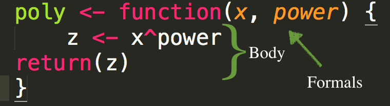

```{r include = FALSE, results = "asis"}
source(here::here("static", "slides", "slide-setup.R"))
xaringanExtra::use_clipboard()
knitr::opts_chunk$set(fig.width = 13, 
                      message = FALSE, 
                      warning = FALSE)

library(tidyverse)
theme_set(theme_minimal(20))
update_geom_defaults("point", list(size = 3))
```

`r setup("w6p1")`

---
# Agenda
* Everything is a function

* Components of a function

* Function workflows

---
# Learning objectives
* Understand and be able to fluently refer to the three fundamental components
of a function

* Understand the workflows that often lead to writing functions, and how you
iterate from interactive work to writing a function

* Be able to write a few basic functions 

---
# Functions
Anything that carries out an operation in R is a function. For example

```{r plus-infix1}
3 + 5
```

--
The `+` is a function (what's referred to as an *infix* function). 


--
Any ideas on how we could re-write the above to make it look more "function"-y?


--
```{r plus-fun}
`+`(3, 5) 
 
``` 

---
# What about this?

```{r plus-infix2}
3 + 5 + 7
```

--

```{r, plus-fun2}
`+`(7, `+`(3, 5))
```


--
### or

```{r, plus-fun3}
library(magrittr)
`+`(3, 5) %>%
	`+`(7)
```

---
# What's going on here?
* The `+` operator is a function that takes two arguments (both numeric),
which it sums. 


--
* The following are also the same (minus what's being assigned)

```{r}
a <- 7
a
`<-`(a, 5)
a
```

--
### Everything is a function!

---
# Being devious
* Want to introduce a devious bug? Redefine `+`

--

```{r bug}
`+` <- function(x, y) {
	if(runif(1) < 0.01) {
		sum(x, y) * -1
	} else {
		sum(x, y)
	}
}
table(map2_dbl(1:500, 1:500, `+`) > 0)
rm(`+`, envir = globalenv())
table(map2_dbl(1:500, 1:500, `+`) > 0)
```


---
# Tricky... 
### Functions are also (usually) objects!

```{r, lm-a}
a <- lm
a(hp ~ drat + wt, data = mtcars)
```

---
# What does this all mean?
* Anything that carries out .b[ANY] operation in R is a function

* Functions are generally, but not always, stored in an object (otherwise
known as binding the function to a name)


---
# Anonymous functions
* The function for computing the mean is bound the name `mean`

* When running things through loops, you may often want to apply a function
without binding it to a name


--
### Example

```{r anonymous-fun}
vapply(mtcars, function(x) length(unique(x)), FUN.VALUE = double(1))
```

---
# Another possibility
* If you have a bunch of functions, you might consider storing them all in a
list.

* You can then access the functions in the same way you would subset any list

```{r fun-list}
funs <- list(
  quarter = function(x) x / 4,
  half = function(x) x / 2,
  double = function(x) x * 2,
  quadruple = function(x) x * 4
)
```

--
.r[.ital[This is kind of weird...]]

---
```{r fun-list-eval}
funs$quarter(100)
funs[["half"]](100)
funs[[4]](100)
```

---
# What does this imply?
* If we can store functions in a vector (list), then we can loop through the
vector just like any other!

--
```{r smry-list}
smry <- list(n = length, 
             n_miss = function(x) sum(is.na(x)),
             n_valid = function(x) sum(!is.na(x)),
             mean = mean, 
             sd = sd)
```

---
```{r smry-loop1}
map_dbl(smry, ~.x(mtcars$mpg))
```

--
### Careful though
This doesn't work

```{r smry-loop1-fail, error = TRUE}
map_dbl(smry, mtcars$mpg)
```

--
### Why?

---
background-image:url(https://d33wubrfki0l68.cloudfront.net/f0494d020aa517ae7b1011cea4c4a9f21702df8b/2577b/diagrams/functionals/map.png)

# Remember what {purrr} does

---
# With `map_df`

```{r map_df_smry, include = FALSE}
map_df(smry, ~.x(mtcars$mpg))
map_df(smry, ~.x(mtcars$cyl))
```

```{r echo = FALSE}
library(flair)
decorate("map_df_smry") %>% 
  flair("mpg", color = "#4f8dde") %>% 
  flair("cyl", color = "#b54fde")
```

--
### What if we wanted this for all columns?

---
# Challenge
* Can you extend the previous looping to supply the summary for every column?
.b[Hint]: You'll need to make a nested loop (loop each function through each column)

`r countdown::countdown(minutes = 5)`

--
```{r smry-all-cols}
map_df(mtcars, function(col) map_df(smry, ~.x(col)),
       .id = "column")
```

---
# Maybe easier
* Often when you get into nested loops, it's easier to turn (at least) one of the loops into a function.

--
```{r summarize_col}
summarize_col <- function(column) {
  map_df(smry, ~.x(column))
}
```

--
Now we can just loop this function through each column

---
```{r all-cols, include = FALSE}
map_df(mtcars, summarize_col, .id = "column")
```

```{r decorate-all-cols, echo = FALSE}
decorate("all-cols") %>% 
  flair("summarize_col", bold = TRUE, color = "#4f8dde")
```

---
# Wrap the whole thing in a function

```{r df-function}
summarize_df <- function(df) {
  map_df(df, summarize_col, .id = "column")
}
```

--
```{r summarize-airquality}
summarize_df(airquality)
```

--
Notice the missing data. Why? What should we do?

---
class: inverse-blue  middle
# Function components

---
# Three components

* `body()`

* `formals()`

* `environment()` (we won't focus so much here for now)





---
# Formals
* The arguments supplied to the function


--
* What's one way to identify the formals for a function - say, `lm`?


--
`?`: Help documentation!


--
Alternative - use a function!

```{r formals-fun}
formals(lm)
```


---
# How do you see the body?

* In RStudio: Super (command on mac, cntrl on windows) + click!

[demo]

* Alternative - just print to screen

---
# Or use `body`

```{r lm-print}
body(lm)
```

---
# Environment
* As I mentioned, we won't focus on this too much, but if you get deep into
programming it's pretty important

```{r env1}
double <- function(x) x*2
environment(double)
environment(lm)
```

---
# Why this matters
What will the following return?

```{r env2-echo, eval = FALSE}
x <- 10
f1 <- function() {
  x <- 20
  x
}

f1()
```

--

```{r env2-eval, echo = FALSE}
x <- 10
f1 <- function() {
  x <- 20
  x
}

f1()
```

---
# What will this return?

```{r env3-echo, eval = FALSE}
x <- 10
y <- 20
f2 <- function() {
  x <- 1
  y <- 2
  sum(x, y)
}
f2()

```

--

```{r env3-eval, echo = FALSE}
x <- 10
y <- 20
f2 <- function() {
  x <- 1
  y <- 2
  sum(x, y)
}
f2()

```

---
# Last one

```{r echo = FALSE}
rm(y)
```

What do each of the following return?

```{r env4-echo, eval = FALSE}
x <- 2
f3 <- function() {
  y <- 1
  sum(x, y)
}

f3() #<<

y #<<
```

--

```{r env4-eval, echo = FALSE, error = TRUE}
x <- 2
f3 <- function() {
  y <- 1
  sum(x, y)
}

f3()

y
```

---
# Environment summary
* The previous examples are part of *lexical scoping*. 

* Generally, you won't have to worry too much about it

* If you end up with unexpected results, this could be part of why

---
# Scoping
* Part of what's interesting about these scoping rules is that your functions
can, and very often do, depend upon things in your global workspace, or your
specific environment.

* If this is the case, the function will be a "one-off", and unlikely to be
useful in any other script


---
# Example 1
### Extracting information

* This is a real example

```{r extract_grades, eval = FALSE}
extract_grades <- function(dif_mod, items) {
  item_names <- names(items)
  delta  <- -2.35*(log(dif_mod$alphaMH))
  grades <- symnum(abs(delta), 
                   c(0, 1, 1.5, Inf), 
                   symbols = c("A", "B", "C"))
  tibble(item = item_names, delta, grades) %>% 
    mutate(grades = as.character(grades))
}

```

---
# Example 2
### Reading in data

```{r read-data-fun, eval = FALSE}
read_sub_files <- function(file) {
  read_csv(file) %>% 
    mutate(
      content_area = str_extract(
        file, "[Ee][Ll][Aa]|[Rr]dg|[Ww]ri|[Mm]ath|[Ss]ci"
      ),
      grade = gsub(".+g(\\d\\d*).+", "\\1", file),
      grade = as.numeric(grade)
    ) %>% 
    select(content_area, grade, everything()) %>% 
    clean_names()
}

ifiles <- map_df(ifiles, read_sub_files)
```

---
# Simple example
### Pull out specific coefficients
```{r mods}
mods <- mtcars %>%
	group_by(cyl) %>%
	nest() %>%
	mutate(
	  model = map(
	    data, ~lm(mpg ~ disp + hp + drat, data = .x)
    )
  )
mods
```

---
# Pull a specific coef
### Find the solution for one model

```{r coefs}
m <- mods$model[[1]]
coef(m)
coef(m)["disp"]
coef(m)["(Intercept)"]
```

---
# Generalize it

```{r pull-coef-fun, include = FALSE}
pull_coef <- function(model, coef_name) {
  coef(model)[coef_name]
}
```

```{r decorate-pull-coef-fun, echo = FALSE}
decorate("pull-coef-fun") %>% 
  flair("coef_name", color = "#4f8dde") %>% 
  flair("model", color = "#b54fde")
```

--

```{r pull-coef1}
mods %>%
	mutate(intercept = map_dbl(model, pull_coef, "(Intercept)"),
	       disp      = map_dbl(model, pull_coef, "disp"),
	       hp        = map_dbl(model, pull_coef, "hp"),
	       drat      = map_dbl(model, pull_coef, "drat"))
```


---
# Make it more flexible
* Since the intercept is a little difficult to pull out, we could have it
return that by default.

```{r pull-coef2}
pull_coef <- function(model, coef_name = "(Intercept)") {
	coef(model)[coef_name]
}
mods %>%
	mutate(intercept = map_dbl(model, pull_coef))
```

---
# Return all coefficients
```{r pull-coef3}
pull_coef <- function(model) {
	coefs <- coef(model)
	data.frame(coefficient = names(coefs),
	           estimate    = coefs)
}
mods %>%
	mutate(coefs = map(model, pull_coef))
```

---
```{r unnest}
mods %>%
	mutate(coefs = map(model, pull_coef)) %>%
	unnest(coefs)
```

---
# Slightly nicer
```{r unnest-better}
mods %>%
	mutate(coefs = map(model, pull_coef)) %>%
	select(cyl, coefs) %>%
	unnest(coefs)
```

---
# Create nice table

```{r unnest-success-table, error = TRUE}
mods %>%
	mutate(coefs = map(model, pull_coef)) %>%
	select(cyl, coefs) %>%
	unnest(coefs) %>%
	pivot_wider(names_from = "coefficient", 
	            values_from = "estimate") %>% 
  arrange(cyl)
```
---
class: inverse-red middle
# When to write a function?

---
# Example

```{r df}
set.seed(42)
df <- tibble::tibble(
  a = rnorm(10, 100, 150),
  b = rnorm(10, 100, 150),
  c = rnorm(10, 100, 150),
  d = rnorm(10, 100, 150)
)

df
```

---
# Rescale each column to 0/1

### Do it for one column

```{r scale1}
df %>%
	mutate(a = (a - min(a, na.rm = TRUE)) / 
                 (max(a, na.rm = TRUE) - min(a, na.rm = TRUE)))
```

---
# Do it for all columns

```{r scale2}
df %>%
	mutate(a = (a - min(a, na.rm = TRUE)) / 
                 (max(a, na.rm = TRUE) - min(a, na.rm = TRUE)),
	       b = (b - min(b, na.rm = TRUE)) / 
                 (max(b, na.rm = TRUE) - min(b, na.rm = TRUE)),
	       c = (c - min(c, na.rm = TRUE)) / 
                 (max(c, na.rm = TRUE) - min(c, na.rm = TRUE)),
	       d = (d - min(d, na.rm = TRUE)) / 
                 (max(d, na.rm = TRUE) - min(d, na.rm = TRUE)))
```

---
# An alternative
* What's an alternative we could use *without* writing a function?

--

```{r scale3}
map_df(df, ~(.x - min(.x, na.rm = TRUE)) / 
              (max(.x, na.rm = TRUE) - min(.x, na.rm = TRUE)))
```


---
# Another alternative
### Write a function

* What are the arguments going to be?

* What will the body be?


--
### Arguments
* One formal argument - A numeric vector to rescale


---
# Body
* You try first

`r countdown::countdown(2)`

--

```{r body-fun, eval = FALSE}
(x - min(x, na.rm = TRUE)) / 
  (max(x, na.rm = TRUE) - min(x, na.rm = TRUE))
```

---
# Create the function

```{r rescale1, include = FALSE}
rescale01 <- function(x) {
  (x - min(x, na.rm = TRUE)) / 
    (max(x, na.rm = TRUE) - min(x, na.rm = TRUE))
}
```

```{r decorate-rescale1, echo = FALSE}
decorate("rescale1") %>% 
  flair("x", color = "#4f8dde") %>%
  flair("function", color = "#B854D4") %>%
  flair("TRUE", color = "#B65610")
```

--
### Test it!

```{r test-rescale1}
rescale01(c(0, 5, 10))
rescale01(c(seq(0, 100, 10)))
```

---
# Make it cleaner
* There's nothing inherently "wrong" about the prior function, but it is a bit
hard to read

* How could we make it easier to read?

--
	+ Remove missing data once (rather than every time)
	
	+ Don't calculate things multiple times

---
# A little cleaned up

```{r rescale2}
rescale01b <- function(x) {
	z <- na.omit(x)
	min_z <- min(z)
	max_z <- max(z)

	(z - min_z) / (max_z - min_z)
}
```

--
### Test it!

```{r test-rescale2}
rescale01b(c(0, 5, 10))
rescale01b(c(seq(0, 100, 10)))
```

---
## Make sure they give the same output

```{r }
identical(rescale01(c(0, 1e5, .01)), rescale01b(c(0, 1e5, 0.01)))

rand <- rnorm(1e3)
identical(rescale01(rand), rescale01b(rand))
```

---
# Final solution
### Could use `modify` here too
```{r df-looped}
map_df(df, rescale01b)
```

---
# Getting more complex
* What if you want a function to behave differently depending on the input?

--
### Add conditions

```{r condition-template1, eval = FALSE}

function() {
	if (condition) {
  
  # code executed when condition is TRUE
	
	} else {
  # code executed when condition is FALSE
	
	}
}
```
---
# Lots of conditions?

```{r condition-template2, eval = FALSE}

function() {
	if (this) {
  
  # do this
	
	} else if (that) {
  
  # do that
	
	} else {

	# something else
	
	}
}
```

---
# Easy example
* Given a vector, return the mean if it's numeric, and `NULL` otherwise

```{r mean2}
mean2 <- function(x) {
	if(is.numeric(x)) {
		mean(x)
	}
	else {
		return()
	}
}
```

---
# Test it

```{r mean2-test}
mean2(rnorm(12))
mean2(letters[1:5])
```

---
# Mean for all numeric columns
* The prior function can now be used within a new function to calculate the mean
of all columns of a data frame that are numeric

```{r df-mean}
means_df <- function(df) {
	means <- map(df, mean2) # calculate means
	nulls <- map_lgl(means, is.null) # find null values
	means_l <- means[!nulls] # subset list to remove nulls
	
	as.data.frame(means_l) # return a df
}
```

---
```{r }
head(iris)
means_df(iris)
```

---
# We have a problem though!

```{r ozone-means}
head(airquality)
means_df(airquality)
```

### Why is this happening? 


### How can we fix it?

---
# Easiest way in this case `...`
### Pass the dots!

Redefine `means2`

```{r means2-redefined}
mean2 <- function(x, ...) {
	if(is.numeric(x)) {
		mean(x, ...)
	}
	else {
		return()
	}
}
```

---
# Reefine means_df

```{r df-mean-redefined}
means_df <- function(df, ...) {
	means <- map(df, mean2, ...) # calculate means
	nulls <- map_lgl(means, is.null) # find null values
	means_l <- means[!nulls] # subset list to remove nulls
	
	as.data.frame(means_l) # return a df
}
```

---
```{r ozone-means2, error }
means_df(airquality)
means_df(airquality, na.rm = TRUE)
```

---
class: inverse-green middle
# Next time
### Functions: Part 2

