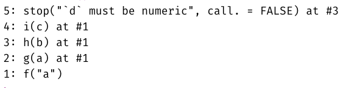

```{r include = FALSE, results = "asis"}
source(here::here("static", "slides", "slide-setup.R"))
xaringanExtra::use_clipboard()
knitr::opts_chunk$set(fig.width = 13, 
                      message = FALSE, 
                      warning = FALSE)

library(tidyverse)
theme_set(theme_minimal(20))
update_geom_defaults("point", list(size = 3))
```

`r setup("w7p2")`

---
# Agenda
* What makes functions "good"

* Building up functions

* Non-standard evaluation

---
# Learning objectives
* Understand how functions build on top of each other and why "only do one
thing" is a good mantra

* Understand non-standard evaluation is, even if you aren't able to fully work
with it

---
class: inverse-red middle
# Brainstorm
What makes a function "good" or "bad"

`r countdown::countdown(minutes = 2)`

---
class: bottom right
background-image:url(img/hadley-tensions.png)
background-size: contain

Slide from Hadley Master R training

---
class: bottom right
background-image:url(img/hadley-errors.png)
background-size: contain

Slide from Hadley Master R training

---
class: bottom left
background-image:url(img/hadley-continuum.png)
background-size: contain

Slide from 

Hadley Master 

R training

---
# What does this mean operationally?
* Your function should do ONE thing (and do it well)

* Careful when naming functions - be as clear as possible

* Embed useful error messages and warnings
	+ Particularly if you're working on a package or set of functions or others
	are using your functions

* Refactor your code to be more clear after initial drafts (it's okay to be
messy on a first draft)


---
# Example 1
* Anything we can do to clean this up?

```{r clean-up1}
both_na <- function(x, y) {
	if(length(x) != length(y)) {
		lx <- length(x)
		ly <- length(y)
		
		v_lngths <- paste0("x = ", lx, ", y = ", ly)

		if(lx %% ly == 0 | ly %% lx == 0) {
			warning("Vectors were recycled (", v_lngths, ")")
		}
		else {
			stop("Vectors are of different lengths and are not recyclable:",
			     v_lngths)	
		}
	}
	sum(is.na(x) & is.na(y))
}

```

---
# Calculate if recyclable

```{r recyclable}
recyclable <- function(x, y) {
	test1 <- length(x) %% length(y)
	test2 <- length(y) %% length(x)

	any(c(test1, test2) == 0)
}
```

---
# Test it

```{r recyclable-test}
a <- c(1, NA, NA, 3, 3, 9, NA)
b <- c(NA, 3, NA, 4, NA, NA, NA)

recyclable(a, b)
recyclable(a, c(b, b))
recyclable(a, c(b, b, b))
recyclable(c(a, a), c(b, b, b))
```

---
# Revision

```{r both_na-rev1}
both_na <- function(x, y) {

	if(!recyclable(x, y)) {
		stop("Vectors are of different lengths and are not recyclable: ",
		     "(x = ", length(x),
		     ", y = ", length(y), ")")	
	}

	if(length(x) == length(y)) {
		return(sum(is.na(x) & is.na(y)))
	}
	
	if(recyclable(x, y)) {
		warning("Vectors were recycled (", 
		        "x = ", length(x), 
		        ", y = ", length(y), ")")
		return(sum(is.na(x) & is.na(y)))
	}
}
```

---
# Test it

```{r both_na-rev1-test, error = TRUE, warning = TRUE}
both_na(a, b)
both_na(a, c(b, b))
both_na(c(a, b), c(b, b, b))
both_na(c(a, a), b)
```

---
# Anything else?

--
### Make errors/warnings a function

--
```{r check-lengths}
check_lengths <- function(x, y) {
	if(!length(x) == length(y)) {
		if(recyclable(x, y)) {
			warning("Vectors were recycled (", 
			        "x = ", length(x), 
			        ", y = ", length(y), ")")
		}
		else {
			stop("Vectors are of different lengths and are not recyclable: ",
		     "(x = ", length(x),
		     ", y = ", length(y), ")")
		}
	}
}
```

---
# Revision 2

```{r rev2}
both_na <- function(x, y) {
	check_lengths(x, y)
	sum(is.na(x) & is.na(y))
}
```


---
# Test it

```{r both_na-test2, error = TRUE, warning = TRUE}
both_na(a, b)
both_na(a, c(b, b))
both_na(c(a, b), c(b, b, b))
both_na(c(a, a), b)
```


---
# Why would we do this?
* In this case - more readable code

* We might re-use the `recyclable` or `check_lengths` functions in other/new
functions

* Helps make de-bugging easier

---
# Quick de-bugging example

```{r nested-funs}
f <- function(a) g(a)
g <- function(b) h(b)
h <- function(c) i(c)
i <- function(d) {
  if (!is.numeric(d)) {
    stop("`d` must be numeric", call. = FALSE)
  }
  d + 10
}
```

---
# traceback

```{r err-traceback, eval = FALSE}
f("a")
traceback()
```



---
class: inverse-blue middle
# Non-standard evaluation (NSE)
### A high-level look

---
# Note
* Were it not for the tidyverse, I would not even mention NSE

* Generally, it's not an incredibly important topic

* But, NSE is ubiquitous in the tidyverse - literally just about everything uses
NSE, which makes programming with tidyverse functions more difficult


---
# What is NSE
* Implementation of different scoping rules

* In dplyr and many others, arguments are evaluated inside the specified data
frames, rather than the current or global environment.


--
### How?
(a) Capture an expression (quote it)
(b) Use the expression within the correct context (evaluate it)

So, `x` is evaluated as, e.g., `df$x` rather than `globalenv()$x`. 


---
# Example
Using the `percentile_df` function we created previously
* Here `base::substitute`

```{r nse-percentile_df}
percentile_df <- function(x) {
	sorted <- sort(x)
	d <- data.frame(sorted, percentile = ecdf(sorted)(sorted))
	names(d)[1] <- paste0(substitute(x), collapse = "_")
	d
}
percentile_df(rnorm(100, 5, 0.2)) %>%
	head()
```

---
# Confusing
* Outside of a function, `substitute` operates just like `quote` - it quotes the
input. 

* Inside of a function, `substitute` does as its name implies - it substitutes
the input for the name.

---
# Example

```{r }
quote(subset(df, select = var))
substitute(subset(df, select = var))
extract_var <- function(df, var) {
	substitute(df)
}
extract_var(mtcars)
```

---
# Actually getting this thing to work

```{r substitute-success1}
extract_var <- function(df, var) {
	subset(eval(substitute(df)), 
	       select = var)
}
extract_var(mtcars, "mpg")
```


---
# Why `eval`
* `substitute` is quoting the input, but we then need to evaluate it.

* All of this is rather confusing

* The tidyverse uses it so frequently, they've decided to implement their own
version, called `tidyeval`, which we'll get to in a minute.


---
# Better
Use NSE for both arguments

```{r substitute-success2}
extract_var <- function(df, var) {
	eval(substitute(var), envir = df)
}
extract_var(mtcars, mpg)
```

--
* The above is equivalent to `df$var` but where both `df` and `var` can be swapped programmatically.

* The `var` argument is being .ital[substituted] in for whatever the user supplies, and is being .ital[evaluated] within the `df` environment

---
# Maybe more simply

```{r substitute-success3}
extract_var <- function(df, var) {
	df[ ,as.character(substitute(var))]
}
extract_var(mtcars, mpg)
```

* Why `as.character`? Otherwise it is a symbol, which won't work.

* Note we could add `drop = FALSE` to this if we wanted to maintain the data frame structure

---
# Taking this even further

```{r extract_vars}
extract_vars <- function(df, ...) {
  vars <- substitute(alist(...))
	df[ ,as.character(vars)[-1]]
}
head(extract_vars(mtcars, mpg, cyl, disp))
```

* We've now basically replicated `dplyr::select`

* Notice the use of `[-1]`, because calling `as.character` on `vars` always returns `alist` as the first element in the vector

---
# Why is NSE used so frequently in the tidyverse?

```{r add_var}
mpg %>% 
  select(manufacturer, model, hwy)
```

---
# Interactive work!

* It makes interactive work easier!

* But this make programming with these functions harder...

* Without NSE, `select` and similar functions would not know where `manufacturer`, `model`, or `hwy` "live". It would be looking for objects in the global environment with these names.


---
# dplyr programming fail

* Let's say we wanted a function that returned means in a nice table-y format
for a variable by two groups (e.g., cross-tab sort of format)


--
* Typically, we would start by solving this problem for a single situation, then
we'd generalize it to a function.


--
* Let's do it!


---
```{r group-means-practice}
mtcars %>%
	group_by(cyl, gear) %>%
	summarize(mean = mean(mpg, na.rm = TRUE)) %>%
	pivot_wider(names_from = cyl, values_from = mean)
```

* Try generalizing the above code into a function

`r countdown::countdown(minutes = 4, 
                        left = 0, 
                        right = 0,
                        bottom = 1,
                        color_running_background = "#FEE11A",
                        color_running_text = "#000")`

---
# Generalize to a function

Typically, we would expect something like this to work

```{r }
group_means <- function(data, outcome, group_1, group_2) {
	data %>%
		group_by(group_1, group_2) %>%
		summarize(mean = mean(outcome, na.rm = TRUE)) %>%
		pivot_wider(names_from = group_1, values_from = mean)
}
```

---
# But it doesn't...

```{r group_means-fail, error = TRUE}
group_means(mtcars, mpg, cyl, gear)
group_means(diamonds, price, cut, clarity)
```

--
### Why?
* It's looking for an object called `group_1` that doesn't exist inside the function or in the global workspace!


---
class: inverse-orange middle
# Solution
Quote it, and evaluate it in the correct place

---
# The {rlang} version

```{r rlang}
group_means <- function(data, outcome, group_1, group_2) {
	out <- enquo(outcome) # Quote the inputs
	g1 <- enquo(group_1)
	g2 <- enquo(group_2)

	data %>%
		group_by(!!g1, !!g2) %>% # !! to evaluate (bang-bang)
		summarize(mean = mean(!!out, na.rm = TRUE)) %>%
		pivot_wider(names_from = !!g1, values_from = mean)
}
```

---

```{r group_means-success}
group_means(mtcars, mpg, cyl, gear)
group_means(diamonds, price, cut, clarity)
```


---
# Alternative: Pass the dots!
* Note, I've made the function a bit simpler here by removing the spread

```{r pass-dots}
group_means2 <- function(data, outcome, ...) {
	out <- enquo(outcome) # Still have to quote the outcome

	data %>%
		group_by(...) %>% 
		summarize(mean = mean(!!out, na.rm = TRUE)) 
}

group_means2(mtcars, mpg, cyl, gear)
group_means2(diamonds, price, cut, clarity)
```


---
# Added benefit
I can now also pass as many columns as I want, and it will still work!

```{r pass-dots2}
group_means2(diamonds, price, cut, clarity, color)
```

---
# Wait a minute!
* This isn't the same thing


--
### Correct
So in this case passing the dots won't fully fix our problem, but there .blue[is] another alternative


---
# Alternative syntax

```{r double-curly-syntax, include = FALSE}
group_means3 <- function(data, outcome, group_1, group_2) {
	  data %>%
		    group_by({{group_1}}, {{group_2}}) %>% 
		    summarize(mean = mean({{outcome}}, na.rm = TRUE)) %>%
		    pivot_wider(names_from = {{group_1}}, values_from = mean)
}

group_means3(mtcars, mpg, cyl, gear)
```

```{r decorate-double-curly-syntax, echo = FALSE}
library(flair)
decorate("double-curly-syntax") %>% 
  flair("{{", color = "#4f8dde") %>% 
  flair("}}", color = "#4f8dde") %>% 
  flair("function", color = "#B854D4") %>% 
  flair("TRUE", color = "#B65610")
```


---
# Pipe-centric
* Because the `data` argument comes first, this function works just like any other in the tidyverse, e.g., 

--
```{r pipe-centric-example}
diamonds %>% 
  filter(color == "E") %>% 
  select(carat, cut, clarity) %>% 
  group_means3(carat, cut, clarity)
```

---
# Syntax note

* The `{{}}` syntax is obviously *much* easier to apply

* It gets you out of tidyeval complications maybe 80% of the time

* If you start doing a lot of programming w/the tidyverse, you'll probably want to read up more no tidyeval and get comfy with quoting/unquoting

---
# Challenge

* Write a function that summarizes any numeric columns by returning the mean, 
standard deviation, min, and max values. 

* For bonus points, embed a meaningful error message if the columns supplied are
not numeric.

Example

```{r summarize_cols-fun, include = FALSE}
summarize_cols <- function(data, ...) {
	data %>%
		select(...) %>%
		pivot_longer(everything(), names_to = "var", values_to = "val") %>%
		group_by(var) %>%
		summarize(mean = mean(val, na.rm = TRUE),
	          	sd = sd(val, na.rm = TRUE),
	          	min = min(val, na.rm = TRUE),
	          	max = max(val, na.rm = TRUE))
}
```

```{r summarize_cols-example1}
summarize_cols(diamonds, depth, table, price)
```

`r countdown::countdown(minutes = 7)`

---
# Pass the dots!

```{r summarize_cols-fun-echo}
summarize_cols <- function(data, ...) {
	data %>%
		select(...) %>%
		pivot_longer(everything(), 
		             names_to = "var", 
		             values_to = "val") %>%
		group_by(var) %>%
		summarize(mean = mean(val, na.rm = TRUE),
	          	sd = sd(val, na.rm = TRUE),
	          	min = min(val, na.rm = TRUE),
	          	max = max(val, na.rm = TRUE))
}
```

---
# Pipe-centric again
Just putting data as the first argument leads to a lot of benefits

```{r smry-cols}
library(palmerpenguins)
penguins %>% 
  select_if(is.numeric) %>% 
  summarize_cols(everything())
```

---
class: inverse-blue middle
# Example with plotting

---
# Linearity
* We want to check if an x/y relation is linear


--
* Function should produce linear and non-linear relations


--
* Optionally show the data

---
# Maybe this?
```{r scatter-fun-fail, error = TRUE}
check_linear <- function(data, x, y, se = TRUE, 
                         points = FALSE) {
	p <- ggplot(data, aes(x, y)) 
           
	if(points) {
	  p <- p + geom_point(color = "gray80")
	}
  if(se) {
  	p <- p +
  	  geom_smooth(method = "lm") +
  	  geom_smooth() 
  }
  else {
  	p <- p +
  	  geom_smooth(method = "lm", se = FALSE) +
  	  geom_smooth(se = FALSE)	
  }
  p
}
```

---
# Nope

```{r error = TRUE}
check_linear(penguins, bill_length_mm, bill_depth_mm)
```


---
# Use tidyeval
Note - there are other approaches too, but they are soft deprecated

```{r scatter-fun-success3}
check_linear <- function(data, x, y, points = FALSE, ...) {
	p <- ggplot(data, aes({{x}}, {{y}})) 
	if (points) {
	  p <- p + geom_point(color = "gray80")
	}   
	p + 
	  geom_smooth(method = "lm",
		            color = "magenta", 
			          ...) +
	  geom_smooth(...)
}
```

---

```{r scatter-tidyeval}
check_linear(penguins, bill_length_mm, bill_depth_mm)
```

---
# Add points

```{r }
check_linear(penguins, bill_length_mm, bill_depth_mm,
             points = TRUE)
```


---
# Add ggplot functions
```{r ggplot-extend, fig.height = 5}
check_linear(mtcars, disp, mpg, se = FALSE) +
	labs(title = "Checking linearity",
	     subtitle = "Linear vs LOESS fits",
	     x = "Engine Displacement",
	     y = "Miles Per gallon") +
	theme_dark(20)
```

---
# Building up plots
* Let's create a function that calculates means and standard errors for every numeric column in a data frame

* We'll then use this function to create a plotting function

---
# Means/SE's
* First figure it out for a single example

* Note there's not built-in function for the standard error of the mean, which is $\frac{\sigma}{\sqrt{n}}$

--

```{r label, options}
# SE function
se <- function(x) {
  x <- x[!is.na(x)]
  sd(x)/sqrt(length(x))
}
```

---
# Full means/SEs

```{r mtcars-mean-se-ex}
penguins %>% 
  select_if(is.numeric) %>% 
  pivot_longer(everything(),
               names_to = "var",
               values_to = "val") %>% 
  group_by(var) %>% 
  summarize(mean = mean(val, na.rm = TRUE),
            se = se(val))
```

---
# Challenge
Try to generalize the code on the previous slide into a  function. Test it on the `forcats::gss_cat` data.

`r countdown::countdown(3)`


---
# Translate to a function

```{r mean-se-fun}
estimate_means <- function(df) {
  df %>% #<<
    select_if(is.numeric) %>% 
    pivot_longer(everything(),
                 names_to = "var",
                 values_to = "val") %>% 
    group_by(var) %>% 
    summarize(mean = mean(val, na.rm = TRUE),
              se = se(val)) 
}
estimate_means(forcats::gss_cat)
```

---
# Plot

```{r fig.height = 5}
ggplot(estimate_means(forcats::gss_cat), 
       aes(var, mean)) +
    geom_errorbar(aes(ymin = mean + qnorm(0.025)*se,
                      ymax = mean + qnorm(0.975)*se),
                  width = 0.4,
                  color = "gray40") +
    geom_point() +
    coord_flip()
```

---
# Create plot function

```{r plot-means}
plot_means <- function(df) {
  means <- estimate_means(df) %>% 
    mutate(var = reorder(factor(var), mean))
  
  ggplot(means, aes(var, mean)) +
    geom_errorbar(aes(ymin = mean + qnorm(0.025)*se,
                      ymax = mean + qnorm(0.975)*se),
                  width = 0.4,
                  color = "gray40") +
    geom_point() +
    coord_flip()
}
```

--
Notice we've successfully avoided tideval entirely in both examples!

---
# Examples
```{r plot-means-ex1}
plot_means(penguins)
```

---
```{r plot-means-ex2}
plot_means(diamonds)
```
---
# Overall takeaway
* Non-standard evaluation is confusing but kind of neat

* Programming with the tidyverse can be a bit more difficult, but not always

* Good to think about multiple ways to approach the same problem (and when programming, perhaps think outside the tidyverse at times)

---
class: inverse-green middle
# Next time
## Intro to shiny